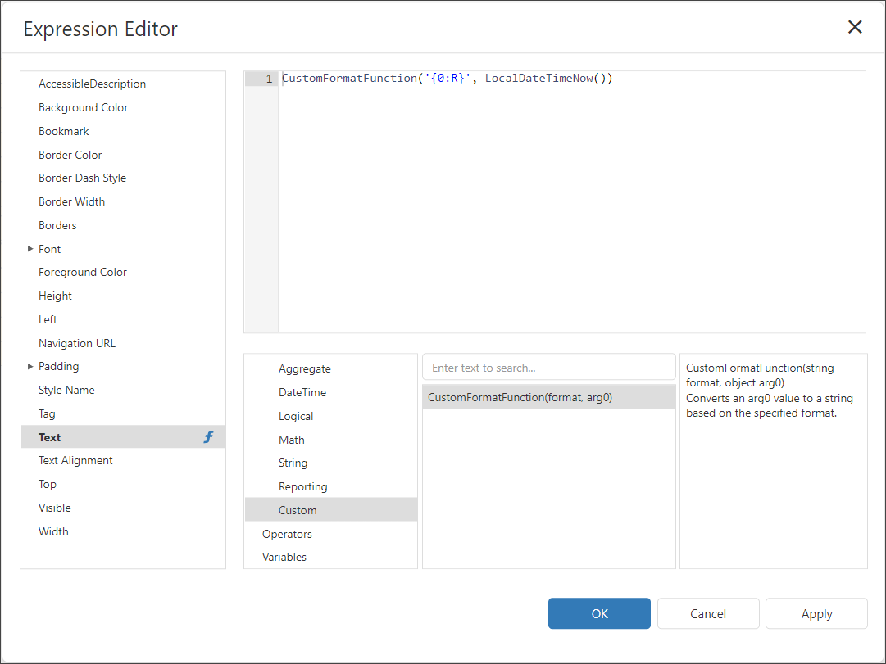
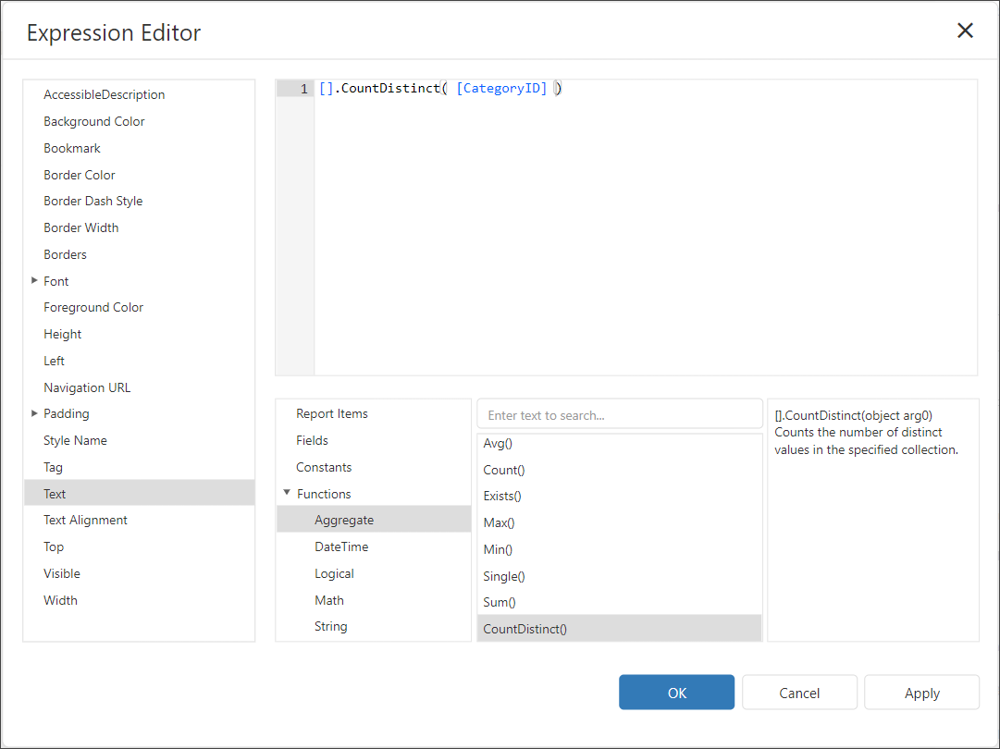

# Reporting for ASP.NET Core - How to Implement a Custom Function in the Expression Editor

This example demonstrates how to implement custom functions for the [Expression Editor](https://docs.devexpress.com/XtraReports/114059/web-reporting/gui/interface-elements/expression-editor) available in the [Web End-User Report Designer](https://docs.devexpress.com/XtraReports/119176/web-reporting/web-end-user-report-designer).

The project implements the following custom functions:

- **CustomFormatFunction** that formats a value with the specified format string.

	
- **CountDistinct** custom aggregate function that calculates the number of distinct values.

    

The `CustomFormatFunction` class inherits from the [ReportCustomFunctionOperatorBase](https://docs.devexpress.com/XtraReports/DevExpress.XtraReports.Expressions.ReportCustomFunctionOperatorBase) class.

The `CountDistinctCustomAggregate` class implements the [ICustomAggregateBrowsable](https://docs.devexpress.com/CoreLibraries/DevExpress.Data.Filtering.ICustomAggregateBrowsable?v=22.1) interface.

## Files to Look At

- [CustomFormatFunction.cs](./CustomFunctionInExpressionAspNetCore/Services/CustomFormatFunction.cs)
- [CountDistinctCustomAggregate.cs](./CustomFunctionInExpressionAspNetCore/Services/CountDistinctCustomAggregate.cs)
- [Index.cshtml](./CustomFunctionInExpressionAspNetCore/Views/Home/Index.cshtml)

## Documentation

- [Custom Functions](https://docs.devexpress.com/XtraReports/403888?v=22.1)
- [Custom Aggregate Functions](https://docs.devexpress.com/XtraReports/403889?v=22.1)
- [CustomFunctions class](https://docs.devexpress.com/XtraReports/DevExpress.XtraReports.Expressions.CustomFunctions)
- [Add or Remove a Function in the Expression Editor (ASP.NET Core)](https://docs.devexpress.com/XtraReports/403261)

## More Examples

- [Expression Editor - How to Implement a Custom Function (WinForms)](https://github.com/DevExpress-Examples/Reporting_expression-editor-how-to-implement-a-custom-new-line-and-format-functions-t211298)